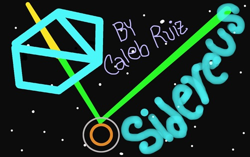

# Sidereus

## Live version
Play a [live version](https://calebjosue.gigalixirapp.com/playground/sidereus/index.html) of this game.

## Mechanics
This is a mobile-first based video game. You get to control Melencolie (Lucky you!) right from the beginning (At least in this proof of concept) in its journey, move it sideways by means of dragging and dropping. Shoot your enemies by tapping in the upper side of your ship. Don't forget to avoid foe missiles! You don't lose life gauge by getting hit by foe space ships.

## History
Sidereus is a video game in which your hand is against everyone, and everyone’s hand against you. I am creating this fantasy, pseudo-science based world on which Verita's life takes place, please find pieces of information related to this story on my YouTube channel and my website, Sidereus is another stop in this journey. Our space ship Melencolie is navigating the outer space but aren't sure of the purpose or what are (they?) looking for and why.

## Further development
There is a gazillion of features to be implemented on Sidereus, there is technical debt too! e.g. Magic numbers, also there is the opportunity to refactor the functions in the update phase. Remember this is but a proof of concept for our story. I will try add some of these enhacements, I am not promising anything.

## Known issues.
It seems some foe space ships are getting filtered without meeting the conditions, the condition seems to be correct. But then again, we didn't implement proper testing for this video game. The details seems to be rare though. Resizing the window support is yet to be added.

## More information.
If you have any further inquiry about this game please visit my [website](https://calebjosue.gigalixirapp.com) so you can let me know.
Thanks!
